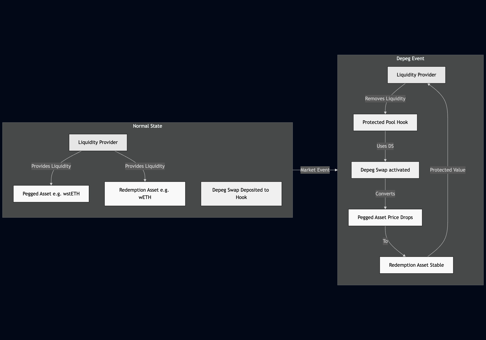

# Protected Pool
This is a uniswap v4 hooks that aims to protect liquidity providers from impermanent loss(in case of depegs) by integrating [Cork Protocol Peg Stability Module](https://docs.cork.tech/core-concepts/peg-stability-module).

## Unified Position Hedging

This hook enables user to hedge their liquidity position by depositing cork [Depeg Swap](https://docs.cork.tech/core-concepts/depeg-swap)(DS) that can be used to convert [Pegged Asset](https://docs.cork.tech/core-concepts/pegged-asset) in the pool(e.g wstETH in wETH:wstETH market) into [Redemption Asset](https://docs.cork.tech/core-concepts/redemption-asset)(this would be wETH in previous example) when removing liquidity from the pool. Further more, the DS that user deposit is **unified**. Meaning, user's DS can be used regardless of user position. I.e user does not need to manage DS position like they need for their liquidity position.


## Future Improvements
- Limit order : a limit order feature would be a great addition to this hook since it would enable use cases like "hedge x% of my position with y amount of RA". This would enable fine grained hedging control with a good balance of UX. But since the underlying logic for DS trades is non-trivial combined with time constraint and the need for an embedded AMM inside the the hook meant this feature would take too much time to complete.
- a way to perpetually hedge position without re-depositing DS :  currently, the hook only support depositing the DS directly. This means for now, you need to manually buy the DS and deposit them into the hook which create UX friction. And you also need to manually rehedge your position everytime the DS expires.

## Running the tests
Make sure you have foundry installed and then clone this repo
```bash
git clone
```
Install the dependency(this would likely take a while to complete since Cork Protocol contracts and dependency is pretty big)
```bash
forge install
```
And then run the test
```bash
forge test
```
